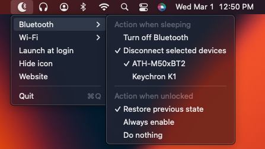

# Bluesnooze (fork)

[Download the latest release.][download-latest]

See what has been changed in this fork by reading the changelog in the releases section.

## About

**Bluesnooze prevents your sleeping Mac from connecting to Bluetooth accessories.**

If you pair Bluetooth headphones or speakers with both your phone & Mac it can be frustrating when your sleeping Mac connects intermittently and disrupts the audio.

With Bluesnooze the Bluetooth connection is switched off when your Mac sleeps, and switched on when your Mac wakes.



## Installation

Minimum macOS version: 10.13 (use [older version](https://github.com/stefansundin/bluesnooze/releases/tag/v1.3) for 10.12)

1. Download `Bluesnooze.zip` from the [latest release][download-latest].
1. In Finder, open `Bluesnooze.zip` in your `Downloads` directory.
1. Drag `Bluesnooze.app` to your `Applications` directory.
1. Launch `Bluesnooze`.
1. *Optional*: Configure <kbd>Launch at login</kbd>.

## Caveats

- The app has an option to hide the icon from the status bar. To show the icon again simply launch the application a second time.
- Please note this app is not compatible with the “Allow your Apple Watch to unlock your Mac” feature.
- Unfortunately this app can't be distributed via the App Store because it uses a private API to switch Bluetooth on/off.

## Settings

The application settings can be modified using the `defaults` command.

```shell
# read settings:
defaults read com.oliverpeate.Bluesnooze disableBluetoothOnPowerDown
defaults read com.oliverpeate.Bluesnooze bluetoothActionOnScreenUnlock
defaults read com.oliverpeate.Bluesnooze disableWifiOnPowerDown
defaults read com.oliverpeate.Bluesnooze wifiActionOnScreenUnlock
defaults read com.oliverpeate.Bluesnooze hideIcon

# update settings:
defaults write com.oliverpeate.Bluesnooze disableBluetoothOnPowerDown -bool false
defaults write com.oliverpeate.Bluesnooze bluetoothActionOnScreenUnlock -string enable
defaults write com.oliverpeate.Bluesnooze disableWifiOnPowerDown -bool true
defaults write com.oliverpeate.Bluesnooze wifiActionOnScreenUnlock -string restore
defaults write com.oliverpeate.Bluesnooze hideIcon -bool true

# delete settings: (this resets everything to defaults)
defaults delete com.oliverpeate.Bluesnooze
```

[download-latest]: https://github.com/stefansundin/bluesnooze/releases/latest
